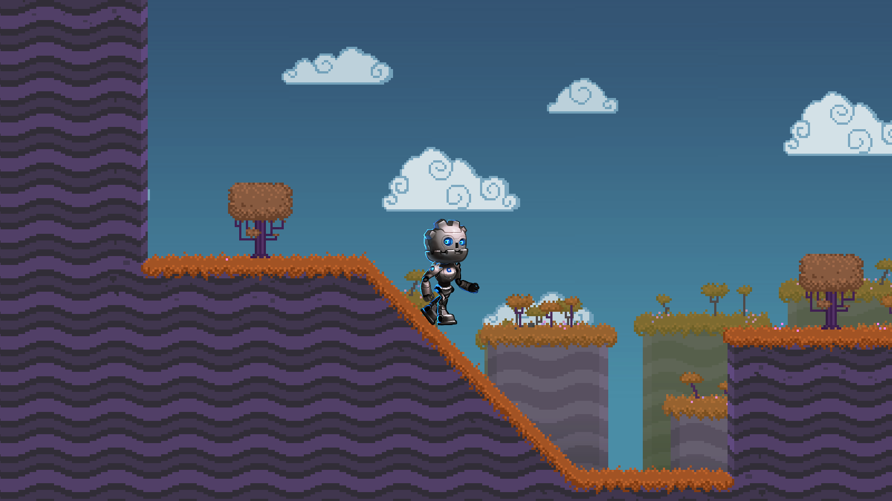

# Demonstração Skeleton2D

Esta demonstração mostra como criar um personagem rigado e animado em 2D usando o nó Skeleton2D do Godot. Existem várias animações relacionadas ao movimento e um controlador de personagem simples que controla as animações.

**Linguagem:** GDScript  
**Renderizador:** Compatibilidade

Confira esta demonstração na biblioteca de assets: [Biblioteca de Assets do Godot](https://godotengine.org/asset-library/asset/1027)

## Licenças

Personagem GBot Copyright &copy; circa 2020 Andreas Esau, Licença MIT.  
Rigging e animação iniciais Copyright &copy; 2020 RustyStriker, Licença MIT.

## Capturas de Tela

